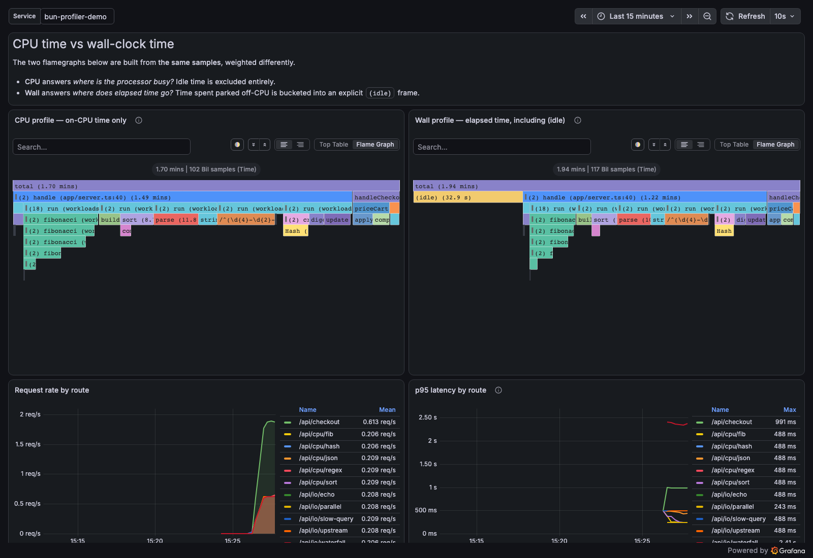
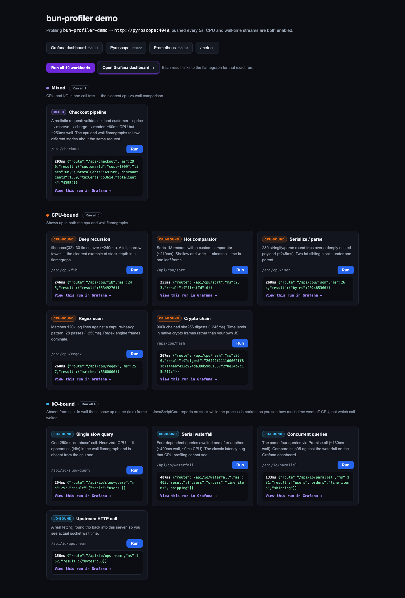
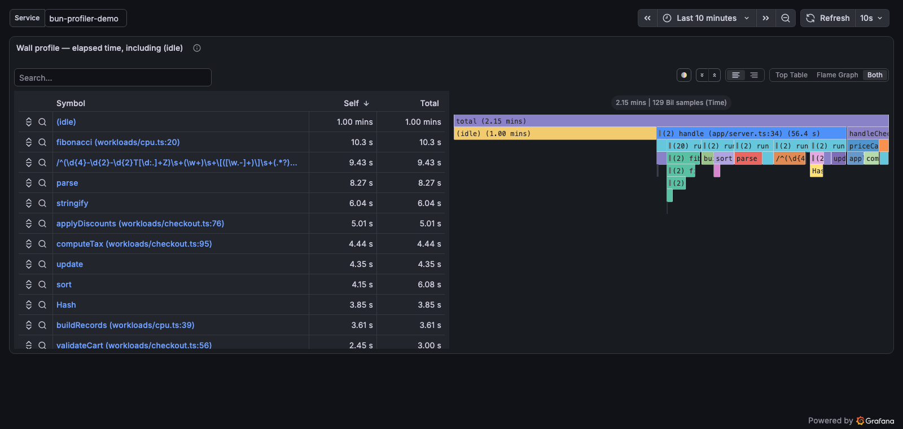

# bun-profiler

Continuous CPU profiling for [Bun](https://bun.sh) via [Pyroscope](https://pyroscope.io) / [Grafana](https://grafana.com/oss/pyroscope/) — zero native dependencies.



<p align="center"><em>The bundled demo stack — <code>bun run dev</code>. Same samples, weighted two ways.</em></p>

## Why this exists

Every other Node.js profiler package (`@pyroscope/nodejs`, `@datadog/pprof`, etc.) **segfaults or silently fails** on Bun because they call V8-specific native APIs that don't exist in JavaScriptCore (JSC). This package uses Bun's built-in `node:inspector` Profiler API directly, converts CDP profiles to Pyroscope's folded-stack format, and pushes them to your Pyroscope server.

## Requirements

- Bun ≥ 1.3.7
- A running Pyroscope instance (self-hosted or Grafana Cloud)

## Install

```sh
bun add bun-profiler
```

## Usage

```ts
import { startProfiling } from "bun-profiler";

// Fire-and-forget — call at app startup
startProfiling({
  pyroscopeUrl: "http://localhost:4040",
  appName: "my-service",
});
```

For manual start/stop control:

```ts
import { BunPyroscope } from "bun-profiler";

const profiler = new BunPyroscope({
  pyroscopeUrl: "http://localhost:4040",
  appName: "my-service",
});

await profiler.start();

// Later, e.g. in tests or graceful shutdown:
await profiler.stop(); // flushes final profile before disconnecting
```

## Configuration

| Option | Type | Default | Description |
|---|---|---|---|
| `pyroscopeUrl` | `string` | — | Pyroscope server URL; required unless `exporters` is set |
| `appName` | `string` | `SERVICE_NAME` env / `npm_package_name` / `"bun-app"` | Application name |
| `sampleIntervalUs` | `number` | `10000` (10ms) | Sampling interval in microseconds |
| `pushIntervalMs` | `number` | `15000` (15s) | How often to flush profiles |
| `labels` | `Record<string, string>` | `{}` | Extra labels (merged with auto-detected) |
| `authToken` | `string` | — | Bearer token for auth |
| `basicAuth` | `{ username, password }` | — | Basic auth credentials |
| `maxRetries` | `number` | `2` | Push retry attempts before dropping window |
| `maxPendingWindows` | `number` | `2` | Bounded pending queue depth per exporter; oldest waiting window is evicted |
| `shutdownTimeoutMs` | `number` | `10000` | Maximum time `stop()` waits for exporters before dropping pending work |
| `exportTimeoutMs` | `number` | `10000` | Per-attempt HTTP deadline for the shorthand Pyroscope exporter |
| `tenantId` | `string` | — | Grafana/Pyroscope `X-Scope-OrgID` tenant |
| `headers` | `Record<string, string>` | `{}` | Safe additional request headers |
| `exporters` | `ProfileExporter[]` | — | Independent file, callback, Pyroscope, or custom destinations |
| `pyroscopeFormat` | `"folded" \| "pprof"` | `"folded"` | Pyroscope CPU encoding; pprof is opt-in during 0.x |
| `compress` | `boolean` | `false` | Gzip the request body — see the warning below |
| `debug` | `boolean` | `false` | Log debug info to stderr |
| `wallTime` | `{ enabled: boolean }` | `{ enabled: false }` | Wall-time profiling (opt-in) |
| `heap` | `{ enabled, samplingIntervalBytes? }` | `{ enabled: false }` | Heap allocation profiling (opt-in) |
| `sourceMaps` | `{ enabled, cacheSize? }` | `{ enabled: false }` | Resolve bundled-JS frames with a bounded map cache |
| `adaptiveSampling` | `{ enabled, ... }` | `{ enabled: false }` | Experimental between-window sampling adjustment |

> **Don't enable `compress` unless you've confirmed your server accepts it.** Grafana Pyroscope's `/ingest` endpoint does not decompress `format=folded` bodies. Verified against `grafana/pyroscope:latest`: a gzipped body is answered with **HTTP 200** and then stored as an empty profile. Nothing errors, nothing retries, and no data ever appears. It defaults to `false` for that reason.

### Environment-first setup

Container deployments can use the same configuration without an application wrapper:

```ts
import { startProfilingFromEnv } from "bun-profiler";

const profiler = startProfilingFromEnv({ labels: { component: "api" } });
```

Explicit overrides win over environment values, which win over defaults. Supported common variables are `PYROSCOPE_SERVER_ADDRESS`, `PYROSCOPE_APPLICATION_NAME`, `PYROSCOPE_LABELS`, `PYROSCOPE_PROFILING_INTERVAL`, `PYROSCOPE_UPLOAD_INTERVAL`, `PYROSCOPE_BASIC_AUTH_USER`, `PYROSCOPE_BASIC_AUTH_PASSWORD`, and `PYROSCOPE_TENANT_ID`. Durations include a unit, for example `10ms`, `15s`, or `2m`.

Library controls use `BUN_PROFILER_*`: `MAX_RETRIES`, `MAX_PENDING_WINDOWS`, `SHUTDOWN_TIMEOUT`, `EXPORT_TIMEOUT`, `DEBUG`, `COMPRESS`, `AUTH_TOKEN`, `PYROSCOPE_FORMAT`, `WALL_TIME_ENABLED`, `HEAP_ENABLED`, `HEAP_SAMPLING_INTERVAL_BYTES`, `SOURCE_MAPS_ENABLED`, `SOURCE_MAP_CACHE_SIZE`, and the `ADAPTIVE_*` variables.

### Exporters and pprof

Each destination has its own sequential, bounded queue. A slow or unavailable backend cannot pause capture or another exporter.
Retryable failures use capped exponential backoff with equal jitter so replicas do not retry in lockstep. HTTP `Retry-After` is honored in both delay-seconds and date forms, with positive jitter and a five-minute safety ceiling.

```ts
import {
  BunPyroscope,
  callbackExporter,
  pprofFileExporter,
  pyroscopeExporter,
} from "bun-profiler";

const profiler = new BunPyroscope({
  appName: "orders",
  exporters: [
    pyroscopeExporter({ url: "http://pyroscope:4040", format: "pprof" }),
    pprofFileExporter({ directory: "./profiles" }),
    callbackExporter("audit", async (window) => console.log(window.from, window.type)),
  ],
});
```

`encodePprof()` emits standards-compatible gzip-compressed `profile.proto`. File exporters also support raw `.cpuprofile` and Speedscope JSON. `ProfileWindow` is immutable at the exporter boundary, and custom exporters implement the small `ProfileExporter` interface.

## Wall-time profiling

CPU profiling only captures on-CPU time — what your code does when it's actively executing JavaScript. For I/O-heavy servers that spend most of their time waiting on external APIs, databases, or network calls, CPU profiles miss the full picture.

Wall-time profiling weights stacks by elapsed microseconds rather than sample count, and surfaces time spent parked off-CPU as an explicit `(idle)` frame.

```ts
startProfiling({
  pyroscopeUrl: "http://localhost:4040",
  appName: "my-api-server",
  wallTime: { enabled: true },
});
```

When enabled, an additional `wall` profile stream is pushed alongside `cpu`. In Pyroscope/Grafana, select the `my-api-server.wall{}` stream to see the wall-time flamegraph.

It adds no extra sampling overhead — it reuses the same CDP profile data as CPU profiling.

### What it can and cannot tell you on Bun

**It tells you how much time went off-CPU. It cannot tell you which call was waiting.**

JavaScriptCore emits no `(idle)` samples and stops sampling altogether while the process is parked, so the first sample taken *after* a wait carries a `timeDelta` spanning the entire wait. Nothing in the profile records what the process was waiting on.

This matters, because attributing that whole delta to the sampled stack — the obvious implementation — blames whichever function happened to resume. Measured on Bun 1.3.14, for a request that awaited 300ms and then ran a 60ms handler:

| | Reported |
| --- | --- |
| Naive: charge the full delta to the sampled stack | `renderReceipt` **354ms** — the function that waited never appears |
| What actually happened | `renderReceipt` 60ms, waiting 300ms |
| This package | `renderReceipt` **58ms**, `(idle)` **301ms** |

A delta larger than twice the sampling interval is treated as a gap: the stack is credited with one sampling interval, and the remainder is booked to `(idle)`. So a `(idle)` block that dwarfs everything else is the signal that your service is I/O-bound — you then reach for request tracing to find *which* call, because a JSC sampling profiler fundamentally cannot answer that.

On Node.js/V8, which does emit real `(idle)` samples, those are already attributed correctly and are passed through untouched.

## Checking the profiler is actually working

Continuous profiling fails quietly. It runs in the background, and a profiler that has stopped delivering looks exactly like a service that happens to be idle — no data either way. `stats()` makes the difference visible:

```ts
const profiler = startProfiling({ pyroscopeUrl: "...", appName: "my-service" });

Bun.serve({
  routes: {
    "/health": () => {
      const s = profiler.stats();
      // "Nothing pushed lately" is NOT a fault — an idle process produces no
      // samples, so empty windows are correct. A dead loop, or pushes that have
      // only ever failed, are unambiguous.
      const degraded = !s.running || (s.pushedWindows === 0 && s.failedWindows > 0);
      return Response.json(s, { status: degraded ? 503 : 200 });
    },
  },
});
```

```json
{
  "running": true,
  "pushedWindows": 42,
  "failedWindows": 0,
  "emptyWindows": 3,
  "lastPushAt": 1785131313353,
  "lastError": null,
  "streams": ["cpu", "wall"]
}
```

`emptyWindows` climbing alongside `pushedWindows` is normal. `emptyWindows` climbing while `pushedWindows` doesn't, on a service you know is busy, means the profiler isn't seeing your work.

This reports what the transport did, so it catches a dead loop and rejected pushes. It cannot catch a server that accepts a push and stores nothing — see the `compress` warning above for the one case where that happens.

`renderPrometheusMetrics(profiler)` exposes the same state without owning an HTTP server: capture gaps and samples, conversion time, per-exporter queue/retry/drop/failure/latency/last-success state, and Bun/Node memory gauges. The examples show plain `Bun.serve`, Hono, and Elysia integration.

## Tagging a region of code

`tag()` splits the profiling window so a specific block of work gets its own labelled stream — useful for a background job, a migration, or one hot endpoint:

```ts
const profiler = new BunPyroscope({ pyroscopeUrl: "...", appName: "my-service" });
await profiler.start();

await profiler.tag({ job: "nightly-report" }, async () => {
  await generateReport();
});
```

The work inside runs under `my-service.cpu{job=nightly-report}`, so you can isolate it in Pyroscope.

It flushes the current window on entry and exit, so each call costs two extra pushes — use it around meaningful units of work, not per request.

Overlapping `tag()` calls fail immediately with `ProfilerConcurrencyError`. Do not create another profiler to work around this: Bun exposes one inspector CPU sampler per process, and concurrent sessions corrupt each other's windows. Use bounded, non-overlapping regions or ordinary profile/resource labels for concurrent work.

## Heap profiling

Opt-in allocation profiling tracks where memory is being allocated:

```ts
startProfiling({
  pyroscopeUrl: "http://localhost:4040",
  appName: "my-service",
  heap: { enabled: true, samplingIntervalBytes: 32_768 },
});
```

When enabled, an `alloc_space` profile stream is pushed alongside `cpu`.

**Bun limitation:** Bun's JavaScriptCore runtime does not currently implement `HeapProfiler.enable`. When heap profiling is enabled on Bun, the profiler logs a warning and continues with CPU-only profiling. Heap profiling works on Node.js/V8. This will be supported once Bun adds HeapProfiler to their inspector implementation.

Low-cost `process.memoryUsage()` and `bun:jsc.heapStats()` gauges remain available in `stats()` and Prometheus output. Full heap snapshots are deliberately on demand:

```ts
import { captureHeapSnapshot } from "bun-profiler";
await captureHeapSnapshot("incident.heapsnapshot");
```

or `bun-profiler heap-snapshot incident.heapsnapshot`. A snapshot can pause the process and be large, so the library never schedules one periodically.

## Preload, CLI, workers, and pull mode

Use the preload entry point when changing application code is undesirable:

```sh
PYROSCOPE_SERVER_ADDRESS=http://localhost:4040 \
PYROSCOPE_APPLICATION_NAME=orders \
bun --preload bun-profiler/preload src/server.ts
```

The CLI is equivalent and can capture short-lived commands offline:

```sh
bun-profiler run --out ./profiles --format pprof -- scripts/import.ts
```

The preload timer is unreferenced and flushes on `beforeExit`, SIGINT, and SIGTERM, so profiling does not keep a finished script alive.

Workers may select the preload through their `preload` option, and worker streams receive a `worker_id` label. Current Bun releases still expose a process-wide inspector sampler, so only one selected isolate—main or one worker—may profile in a process at a time. `bun run dev:workers` demonstrates the supported pattern and reports the limitation explicitly.

For systems that scrape Go-style endpoints, `createPprofHandler()` provides `/debug/pprof/profile?seconds=N` behavior without creating a server. It coalesces concurrent scrapes and returns `409` when continuous push mode owns the sampler. Pull and push mode are intentionally mutually exclusive.

## Source maps and experimental signals

Directly executed TypeScript already carries original locations in Bun profiles. For bundled JavaScript, `sourceMaps: { enabled: true }` resolves inline or external maps using a bounded cache and falls back to generated positions on any map or filesystem error.

Adaptive sampling is opt-in and only changes the sampling interval between windows. Every change is counted in stats and fixed 100 Hz sampling remains the default.

OTLP Profiles is Alpha. The current OTLP/HTTP JSON exporter therefore lives behind the explicitly unstable entry point and posts to `/v1development/profiles`:

```ts
import { otlpHttpProfilesExporter } from "bun-profiler/experimental";
```

It adds window-level resource labels only. The library does not invent per-span or per-request attribution because Bun's sampler does not expose the context needed to associate a CDP sample with an async span.

## Auto-detected labels

The following labels are added automatically when the corresponding environment variables are set:

| Label | Environment variable(s) |
|---|---|
| `service_name` | `SERVICE_NAME`, `npm_package_name`, or `appName` option |
| `service_version` | `SERVICE_VERSION`, `npm_package_version` |
| `environment` | `NODE_ENV`, `BUN_ENV` |
| `hostname` | `os.hostname()` (always present) |
| `fly_region` | `FLY_REGION` |
| `fly_app_name` | `FLY_APP_NAME` |
| `aws_region` | `AWS_REGION`, `AWS_DEFAULT_REGION` |
| `railway_region` | `RAILWAY_REGION` |
| `railway_service` | `RAILWAY_SERVICE_NAME` |
| `pod_name` | `POD_NAME` |
| `k8s_namespace` | `K8S_NAMESPACE` |

Extra labels passed via the `labels` option override auto-detected values.

## Try it locally

A complete demo stack — Bun app, Pyroscope, Grafana, Prometheus — lives in [`dev/`](./dev).

```sh
bun run dev:demo   # start everything, then drive 60s of traffic
bun run dev:alloy  # app -> Alloy receive_http -> two Pyroscope destinations
bun run dev:failures # 429/500/timeout/recovery fault injection
bun run dev:workers  # selected worker-isolate fixture
bun run dev:otlp   # experimental OTLP Profiles -> Collector debug exporter
bun run bench      # unprofiled/CPU/wall/pprof/worker comparison
```

It waits until the stack is serving and prints the URLs — by default
<http://localhost:3003/d/bun-profiler-demo>. (Ports are per-workspace under
[Conductor](https://conductor.build), so take them from the output.)

The demo server exposes workloads with deliberately distinct flamegraph shapes — deep recursion, a hot comparator, regex scanning, crypto — alongside I/O-bound ones and a realistic mixed `/api/checkout` pipeline. Drive them from the panel the script links to (<http://localhost:3002> by default), individually, by group, or all at once. Every result links straight to the flamegraph for that exact run:



The provisioned dashboard puts the two profiles side by side. Same samples, weighted differently:


The CPU profile contains no idle time at all — every frame is real compute, and it points at `applyDiscounts` and the regex scan. The wall profile, over the same window, shows that the largest single block is `(idle)`:



That contrast is the whole argument for wall-time profiling: the CPU flamegraph tells you which loop to optimise, while the wall flamegraph tells you whether optimising it would matter at all.

Those three images are not hand-captured. `bun run screenshots` drives the live stack with Playwright — clicks "Run all", waits for the profiler to push, generates 90s of mixed traffic, blocks until Prometheus actually returns series, then captures Grafana. It fails if any panel renders "No data" or a result is missing its deep link, so regenerating them is itself an end-to-end test.

See [`dev/README.md`](./dev/README.md) for the full workload list and troubleshooting.
Deployment constraints, failure modes, Kubernetes environment configuration, migration guidance, and the custom-exporter contract are in [`docs/production.md`](./docs/production.md).

## Development

```sh
bun install
bun run l       # typecheck + lint + tests
bun run build
```

## How it works

1. Connects to Bun's embedded JavaScriptCore inspector via `node:inspector/promises`
2. Every `pushIntervalMs`: stops the profiler, immediately starts the next sampling window, and measures that unavoidable stop/start gap
3. Converts the completed CDP window and hands it to independent bounded exporter queues while sampling has already resumed
4. On SIGTERM/SIGINT: flushes the current window before exiting

Step 2 still leaves a small unavoidable inspector stop/start blind spot, but conversion, pprof encoding, retries, and network I/O are no longer inside it. `lastCaptureGapMs`, `maxCaptureGapMs`, and the Prometheus gap metrics make the remaining loss observable.

## Why not `Bun.jsc.profile()`?

Bun exposes `bun:jsc` with a `profile()` function, but it's **not suitable** for continuous profiling:

- **Wrong output format** — `Bun.jsc.profile()` returns a `SamplingProfile` with pre-formatted text strings (`.functions`, `.bytecodes`, `.stackTraces`), not structured CDP/V8 JSON with `nodes`/`samples`/`timeDeltas`. There's no way to convert this to folded stacks without writing a brittle text parser.
- **No start/stop control** — `Bun.jsc.startSamplingProfiler()` has no corresponding stop function. It's a fire-and-forget debug tool that writes to a directory, not a programmatic API.
- **`node:inspector` already works** — Bun added full `node:inspector` Profiler support in [v1.3.7](https://bun.sh/blog/bun-v1.3.7) (November 2024). This is the same CDP API that Chrome DevTools uses, returning proper `CdpProfile` objects that convert directly to Pyroscope's folded-stack format. That's why the minimum Bun version is 1.3.7.

If you're on Bun < 1.3.7, you'll get a clear error from `start()` explaining the requirement. Upgrade Bun and it works out of the box.

## Graceful shutdown

Signal handlers are installed automatically. On SIGTERM or SIGINT, the profiler flushes the current window and disconnects before re-emitting the signal so your process exits normally.

## Release

```sh
bun run release:patch   # 0.1.0 → 0.1.1  (bug fixes)
bun run release:minor   # 0.1.0 → 0.2.0  (new features)
bun run release:major   # 0.1.0 → 1.0.0  (breaking changes)
```

Bumps `package.json`, commits, tags, and pushes. GitHub Actions publishes to npm automatically via OIDC trusted publishing — no token required.

## License

MIT

---

Built by [mewc](https://x.com/the_mewc) · [ChartCastr](https://chartcastr.com)
